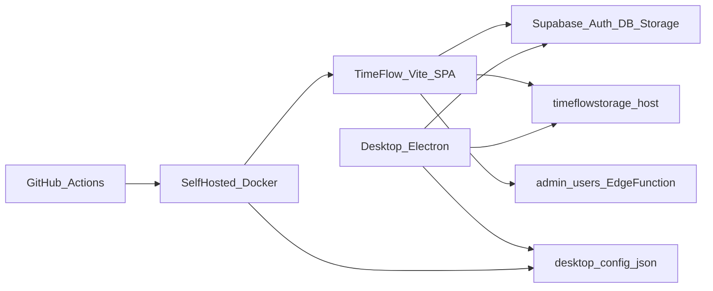

# TimeFlow Security Audit Report

| Field | Value |
|--------|--------|
| **Engagement type** | Comparative re-verification security audit (report-only; no new remediation in this pass) |
| **Date** | 31 August 2026 |
| **Prior reports** | v1.0 / v1.1 (24 Aug 2026), v1.2 (28 Aug 2026) |
| **Scope** | TimeFlow web (`TimeFlow/`), Electron desktop (`timeflow-desktop-app/`), Tracker Supabase project, GitHub Actions / on-prem Docker deploy, client contract for `timeflowstorage.mechlintech.com` |
| **Overall posture** | **Improved (Moderate)** — Critical DB break closed; **keys rotated** (C-02 resolved); site config restored; remaining items marked Resolved / Unresolved below |
| **Auditor method** | Static code re-review + live Supabase advisors/SQL inventory + dependency audit + desktop-config reachability check + owner confirmation of key rotation |

---

## 1. Executive summary

TimeFlow is a Vite/React SPA and Electron desktop client that talk **directly** to Supabase (Auth + PostgREST + Storage) and an external screenshot host. Security depends on Supabase RLS, grants, Auth, and Edge Functions.

**v1.3 (31 August 2026) confirms the Critical live-database exposure from v1.0 remains remediated.** Supabase advisors: **0 ERROR**, **46 WARN** (same WARN themes as v1.2). Core tables still have RLS + FORCE. `https://timeflow.mechlintech.com/desktop-config.json` returns **HTTP 200**. Desktop **1.7.0** loads Supabase publishable config **from the site only**. **Owner confirmed API / service_role key rotation** — C-02 is now **Resolved**.

**Still unresolved (general):** storage-server JWT enforcement confirmation, Postgres upgrade, Auth OTP/HIBP, desktop npm highs, DEFINER WARN cleanup, OAuth token-in-URL residual, tasks org-wide SELECT, HSTS at edge, and other Partial/Mitigated/Open items in §2.3.

### Status legend (used in comparative tables)

| Status | Meaning |
|--------|---------|
| **Resolved** | General term (v1.3): issue closed or accepted — no further action required for this finding |
| **Unresolved** | General term (v1.3): issue still open, partial, or awaiting further work |
| **Open** | Finding active / unmitigated |
| **Fixed** | Remediation verified in code and/or live DB |
| **Mitigated** | Risk reduced; residual owner action or external dependency |
| **Partial** | Some controls in place; gap remains |
| **Accepted** | Risk accepted as intentional |
| **Info** | Informational / positive note |
| **N/A** | Finding not yet identified in that report version |

**v1.3 column format:** `Resolved|Unresolved` — *detail status* (e.g. Fixed, Partial, Mitigated).

---

## 2. Comparative summary (all report versions)

### 2.1 Engagement timeline

| Version | Date | Type | Overall posture | Advisors (live) |
|---------|------|------|-----------------|-----------------|
| **v1.0** | 24 Aug 2026 | Initial report-only audit | **Weak** | Multiple **ERROR** (RLS disabled on core tables) |
| **v1.1** | 24 Aug 2026 | Remediation implementation pass | Improving (post-fix) | **0 ERROR** after migrations |
| **v1.2** | 28 Aug 2026 | Re-verification | **Improved (Moderate)** | **0 ERROR**, **46 WARN** |
| **v1.3** | 31 Aug 2026 | Comparative re-verification | **Improved (Moderate)** | **0 ERROR**, **46 WARN** |

### 2.2 Finding counts by severity over time

| Severity | v1.0 Open | v1.1 After rem. | v1.2 Residual | v1.3 Resolved | v1.3 Unresolved |
|----------|----------:|----------------:|--------------:|--------------:|----------------:|
| Critical | 5 | 0 open in DB (1 owner rotate) | 0 open in DB (1 owner rotate) | **5** | **0** |
| High | 8 | mostly fixed / mitigated | 2 partial/mitigated | **6** | **2** (H-01, H-03) |
| Medium | 10 | mostly fixed / mitigated | several residual | **5** | **5** (+ N-01) |
| Low / Info | 6 | mostly closed / accepted | few residual | **4** | **2** (+ N-02, N-03) |
| New since v1.0 | — | — | N-01…N-03 | — | N-01…N-03 still unresolved |

### 2.3 Master comparative status table (issues × versions)

| ID | Sev | Issue | v1.0 | v1.1 | v1.2 | v1.3 (31 Aug) — Resolved / Unresolved |
|----|-----|-------|------|------|------|----------------------------------------|
| C-01 | Critical | RLS disabled on core tables; broad `anon` grants | **Open** | **Fixed** | **Fixed** (live verified) | **Resolved** — Fixed (RLS+FORCE live) |
| C-02 | Critical | `service_role` JWT committed in repo | **Open** | **Mitigated** (removed from tree; rotate pending) | **Mitigated** / owner-action | **Resolved** — Fixed (keys rotated by owner) |
| C-03 | Critical | `get_user_id_by_email` DEFINER executable by `anon` | **Open** | **Fixed** | **Fixed** | **Resolved** — Fixed |
| C-04 | Critical | `backfill_screenshot_user_id_batch` DEFINER callable by `anon` | **Open** | **Fixed** | **Fixed** | **Resolved** — Fixed |
| C-05 | Critical | Storage policies overly permissive (`qual/with_check true`) | **Open** | **Fixed** | **Fixed** | **Resolved** — Fixed |
| H-01 | High | OAuth open callback + tokens in query string | **Open** | **Fixed** (allowlist) | **Partial** (allowlist yes; tokens still in URL) | **Unresolved** — Partial (tokens still in URL) |
| H-02 | High | Electron `nodeIntegration` / no `contextIsolation` | **Open** | **Fixed** | **Fixed** | **Resolved** — Fixed |
| H-03 | High | Unauthenticated uploads to screenshot storage host | **Open** | **Mitigated** (clients send Bearer; server TBD) | **Mitigated** / owner-action | **Unresolved** — Mitigated (server JWT still TBD) |
| H-04 | High | `supabase.auth.admin.*` from browser | **Open** | **Fixed** (Edge Function) | **Fixed** | **Resolved** — Fixed |
| H-05 | High | Hardcoded anon keys (Tracker + HRMS) in source | **Open** | **Fixed** (env-only) | **Fixed** | **Resolved** — Fixed (desktop site-only) |
| H-06 | High | UI-only admin authorization | **Open** | **Fixed** (RLS + Edge) | **Fixed** | **Resolved** — Fixed |
| H-07 | High | Notifications insert `WITH CHECK (true)` | **Open** | **Fixed** | **Fixed** | **Resolved** — Fixed |
| H-08 | High | Web npm critical/high advisories | **Open** | **Mitigated** (upgrades) | **Fixed** (0 vulns) | **Resolved** — Fixed (0 vulns) |
| M-01 | Medium | Missing nginx security headers | **Open** | **Fixed** | **Mostly fixed** (no HSTS in container) | **Unresolved** — Mostly fixed (HSTS TBD) |
| M-02 | Medium | `.env` not gitignored | **Open** | **Fixed** | **Fixed** | **Resolved** — Fixed |
| M-03 | Medium | Self-hosted CI/CD + secrets / build-args | **Open** | **Mitigated** | **Mitigated** | **Unresolved** — Mitigated |
| M-04 | Medium | Dual deploy paths (Pages + Docker) | **Open** | **Fixed** | **Fixed** | **Resolved** — Fixed |
| M-05 | Medium | Cross-project HRMS Supabase client | **Open** | **Mitigated** | **Mitigated** | **Unresolved** — Mitigated (HRMS RLS TBD) |
| M-06 | Medium | Password login `/login/direct` in production | **Open** | **Fixed** (DEV-only) | **Fixed** | **Resolved** — Fixed |
| M-07 | Medium | DEFINER surface + mutable `search_path` | **Open** | **Mitigated** | **Partial** (46 WARN) | **Unresolved** — Partial (46 WARN) |
| M-08 | Medium | Projects/tasks SELECT `qual: true` | **Open** | **Fixed** (projects scoped) | **Mostly fixed** (tasks still org-wide) | **Unresolved** — Mostly fixed (tasks org-wide) |
| M-09 | Medium | Desktop `app_versions` over-broad SQL | **Open** | **Fixed** | **Fixed** | **Resolved** — Fixed |
| M-10 | Medium | Desktop npm high advisories | **Open** | **Mitigated** | **Open** (3 high) | **Unresolved** — Open (3 high) |
| L-01 | Low | Public buckets avatars / tracker-application | **Open** (review) | **Accepted** | **Accepted** | **Resolved** — Accepted |
| L-02 | Low | OAuth debug console logging | **Open** | **Fixed** | **Fixed** | **Resolved** — Fixed |
| L-03 | Low | Screenshot volume / privacy sensitivity | **Open** | **Mitigated** (doc) | **Mitigated** | **Unresolved** — Mitigated (~1.97M rows) |
| L-04 | Low | No Dependabot / CodeQL / audit CI | **Open** | **Fixed** (Dependabot + audit CI) | **Partial** (no CodeQL) | **Unresolved** — Partial (no CodeQL) |
| L-05 | Info | SPA anon key expected if RLS correct | **Info** | **Info** | **Info** (RLS OK) | **Resolved** — Info |
| L-06 | Info | Admin-gated DEFINER log readers (positive) | **Info** | **Info** | **Info** | **Resolved** — Info |
| N-01 | Medium | Postgres version has security patches available | N/A | N/A | **Open** | **Unresolved** — Open |
| N-02 | Low | Auth OTP expiry &gt; 1 hour | N/A | N/A | **Open** | **Unresolved** — Open |
| N-03 | Low | Leaked-password protection (HIBP) disabled | N/A | N/A | **Open** | **Unresolved** — Open |

### 2.4 Domain posture comparison

| Domain | v1.0 | v1.1 | v1.2 | v1.3 |
|--------|------|------|------|------|
| Supabase RLS / grants | Critical weakness | Strong (core) | Strong (core) | **Strong (core)** |
| Secrets / key handling | Critical weakness | Improved | Improved | **Strong** (keys rotated; desktop site-only) |
| AuthN (SSO/PKCE) | Developing | Developing+ | Developing+ | Developing+ |
| AuthZ (app + DB) | Critical weakness | Strong (core) | Strong (core) | **Strong (core)** |
| Electron hardening | Weak | Improved | Improved | Improved |
| External storage | Weak | Mitigated client-side | Mitigated; server TBD | Mitigated; server TBD |
| Config host availability | Assumed up | Assumed up | Site down (530) noted operationally | **HTTP 200** for `desktop-config.json` |
| CI/CD | Developing | Developing+ | Developing+ | Developing+ |
| Dependency hygiene | Developing | Web improved | Web clean; desktop residual | Web clean; desktop residual |
| HTTP hardening | Weak | Improved | Improved (HSTS TBD) | Improved (HSTS TBD) |
| Platform / Auth settings | — | — | OTP/HIBP/Postgres WARNs | Same WARNs |

### 2.5 What changed between v1.2 and v1.3

| Area | v1.2 | v1.3 |
|------|------|------|
| Live advisor ERROR | 0 | 0 |
| Live advisor WARN | 46 | 46 (same name breakdown) |
| Core RLS + FORCE | Verified | Re-verified still enabled |
| `service_role` / API key rotation (C-02) | Owner-action pending | **Resolved** — owner confirmed keys rotated |
| `desktop-config.json` | Operational outage risk (530 observed around 30 Aug) | **Reachable (HTTP 200)** |
| Desktop Supabase creds | Env for local / remote for packaged | **Site-only** for all runs; friendly server-down message |
| Web `npm audit` | 0 | 0 |
| Desktop `npm audit` | 3 high | 3 high (**Unresolved**) |
| v1.3 roll-up | — | **Resolved** vs **Unresolved** labeled on every finding |
| Data volumes | profiles 74 / TE 15,493 / SS ~1.95M | profiles 74 / TE 15,583 / SS ~1.97M |

### 2.6 Owner-action / unresolved checklist (v1.3)

| # | Action | First noted | v1.3 |
|---|--------|-------------|------|
| 1 | Rotate Tracker `service_role` / API keys in Dashboard | v1.1 | **Resolved** (owner confirmed) |
| 2 | Confirm `timeflowstorage` rejects requests without valid Bearer JWT | v1.1 | **Unresolved** |
| 3 | Upgrade Postgres (advisor N-01) | v1.2 | **Unresolved** |
| 4 | Set Auth OTP &lt; 1h; enable HIBP (N-02, N-03) | v1.2 | **Unresolved** |
| 5 | Patch desktop npm highs (M-10) | v1.0 / open again v1.2 | **Unresolved** |
| 6 | Optional: token-free desktop OAuth handoff (H-01) | v1.2 | **Unresolved** |
| 7 | Optional: DEFINER/`search_path` WARN cleanup (M-07) | v1.0 | **Unresolved** |
| 8 | Optional: scope tasks SELECT (M-08) | v1.2 | **Unresolved** |
| 9 | Optional: HSTS at TLS edge (M-01) | v1.2 | **Unresolved** |

---

## 3. Scope, methodology, and framework mapping

### In scope

- Web app: Vite 5 + React 18 SPA (`timeflow.mechlintech.com`)
- Desktop: Electron 28 tracker app (build **1.7.0**)
- Supabase project `yxkniwzsinqyjdqqzyjs` (live advisors + SQL as of 31 Aug 2026)
- CI/CD: `.github/workflows/deployment.yml`, `deploy.yml`, `security-checks.yml`
- External storage host as used by clients (server source **not** in repo)

### Out of scope

- Formal pen test / social engineering
- HRMS project RLS deep audit
- Implementing new remediations in this pass
- Proving storage-server JWT enforcement beyond client contract

### Control framework (tailored, not certification)

| Framework | Use in this audit |
|-----------|-------------------|
| **OWASP ASVS L2** | Primary control backbone |
| **OWASP Top 10 / API Top 10** | Finding tags |
| **Supabase security model** | RLS, grants, DEFINER, service_role, Storage |
| **GitHub security practices** | Workflows, secrets, self-hosted runner |
| **CIS Controls (selected)** | Secret hygiene, hardening |

### Architecture (threat model)

### Checks performed (v1.3)

- Comparative roll-forward of all prior finding IDs
- Live Supabase `get_advisors` (security), RLS/FORCE flags, row counts
- Web + desktop `npm audit --omit=dev`
- Probe `https://timeflow.mechlintech.com/desktop-config.json`
- Spot-check: OAuth allowlist, `callAdminUsers`, storage Bearer header, Electron site-only `getSupabaseConfig`, `contextIsolation`

---

## 4. Findings summary (current = v1.3)

| ID | Severity | Title | Detail status | General (v1.3) |
|----|----------|-------|---------------|----------------|
| C-01 | Critical | RLS disabled on core public tables | Fixed | **Resolved** |
| C-02 | Critical | `service_role` committed | Fixed (keys rotated) | **Resolved** |
| C-03 | Critical | `get_user_id_by_email` to anon | Fixed | **Resolved** |
| C-04 | Critical | backfill DEFINER to anon | Fixed | **Resolved** |
| C-05 | Critical | Overly permissive Storage policies | Fixed | **Resolved** |
| H-01 | High | OAuth callback + tokens in URL | Partial | **Unresolved** |
| H-02 | High | Insecure Electron webPreferences | Fixed | **Resolved** |
| H-03 | High | Unauthenticated storage uploads | Mitigated (server TBD) | **Unresolved** |
| H-04 | High | Auth Admin from browser | Fixed | **Resolved** |
| H-05 | High | Hardcoded publishable keys | Fixed (desktop site-only) | **Resolved** |
| H-06 | High | UI-only admin gate | Fixed | **Resolved** |
| H-07 | High | Notifications open insert | Fixed | **Resolved** |
| H-08 | High | Web dependency advisories | Fixed | **Resolved** |
| M-01 | Medium | Missing HTTP security headers | Mostly fixed (HSTS TBD) | **Unresolved** |
| M-02 | Medium | `.env` not gitignored | Fixed | **Resolved** |
| M-03 | Medium | Self-hosted CI/CD secrets | Mitigated | **Unresolved** |
| M-04 | Medium | Dual deploy paths | Fixed | **Resolved** |
| M-05 | Medium | Cross-project HRMS client | Mitigated | **Unresolved** |
| M-06 | Medium | Password login exposed | Fixed | **Resolved** |
| M-07 | Medium | DEFINER / search_path WARN surface | Partial | **Unresolved** |
| M-08 | Medium | Org-wide projects/tasks SELECT | Mostly fixed | **Unresolved** |
| M-09 | Medium | Desktop app_versions SQL | Fixed | **Resolved** |
| M-10 | Medium | Desktop npm highs | Open | **Unresolved** |
| L-01 | Low | Public buckets | Accepted | **Resolved** |
| L-02 | Low | OAuth debug logs | Fixed | **Resolved** |
| L-03 | Low | Screenshot privacy volume | Mitigated | **Unresolved** |
| L-04 | Low | CI security tooling gaps | Partial | **Unresolved** |
| L-05 | Info | SPA anon key pattern | Info | **Resolved** |
| L-06 | Info | Admin-gated log RPCs | Info | **Resolved** |
| N-01 | Medium | Vulnerable Postgres version | Open | **Unresolved** |
| N-02 | Low | Auth OTP long expiry | Open | **Unresolved** |
| N-03 | Low | HIBP protection disabled | Open | **Unresolved** |

---

## 5. Finding details (current evidence highlights)

### Critical (C-01 … C-05)

| ID | v1.3 evidence |
|----|---------------|
| C-01 | Live: `profiles`, `time_entries`, `project_time_entries`, `system_settings` → RLS **true**, FORCE **true** |
| C-02 | **Resolved** — Owner confirmed key rotation; secret removed from tree earlier ([KEY_ROTATION.md](KEY_ROTATION.md)) |
| C-03 / C-04 | Prior live revoke to `service_role` retained (no ERROR advisors) |
| C-05 | Prior path-scoped storage policies retained (no ERROR advisors) |

### High (selected residuals)

| ID | v1.3 notes |
|----|------------|
| H-01 | Allowlist intact; desktop/web still pass `access_token` / `refresh_token` on allowlisted callbacks |
| H-03 | Clients send `Authorization: Bearer`; storage server enforcement still owner-verify |
| H-05 | Desktop preload fetches site config only; friendly “Unable to connect to TimeFlow servers” on failure |

### Medium / Low / New

| ID | v1.3 notes |
|----|------------|
| M-07 | Advisors: 15 anon DEFINER executable, 19 authenticated, 9 mutable `search_path` |
| M-08 | Tasks SELECT still `true` for authenticated (projects membership-scoped) |
| M-10 | Desktop `npm audit`: 3 high (`ws`, `minimatch`) |
| M-01 | CSP/XFO/nosniff/Referrer present; no HSTS in Dockerfile |
| N-01 | `supabase-postgres-15.8.1.105` patches available |
| N-02 / N-03 | OTP long expiry; HIBP disabled |
| L-03 | ~1,969,951 screenshot rows |

---

## 6. ASVS-oriented control coverage (v1.0 → v1.3)

| ASVS domain | v1.0 | v1.3 |
|-------------|------|------|
| V1 Architecture | Fail | Partial |
| V2 Authentication | Partial | Partial |
| V3 Session | Partial | Partial |
| V4 Access control | Fail | **Pass (core)** |
| V5 Validation / XSS | Partial | Improved |
| V8 Data protection | Fail | Improved |
| V9 Communication | Partial | Improved |
| V10 Malicious code | Partial | Improved (web clean) |
| V12 Files / media | Fail | Partial |
| V13 API | Fail | Improved |
| V14 Config | Fail | Improved |

---

## 7. Prioritized remediation roadmap (advisory)

### Still unresolved — 0–7 days

1. Confirm **storage JWT middleware** ([docs/STORAGE_SERVER_AUTH.md](docs/STORAGE_SERVER_AUTH.md)).
2. Schedule **Postgres upgrade** (N-01).
3. Patch desktop npm highs (M-10).
4. Auth OTP &lt; 1h + enable HIBP (N-02, N-03).

### 8–30 days

5. Token-free desktop OAuth handoff (H-01).
6. DEFINER execute / `search_path` cleanup (M-07).
7. Decide tasks visibility model (M-08).
8. Confirm HSTS at TLS edge (M-01).

### 31–90 days

9. Drive advisors toward zero WARN on DEFINER themes.
10. Screenshot retention enforcement (L-03).
11. Light pen test: PostgREST + storage host + Edge Functions + desktop-config host.

---

## 8. Appendix

### A. Positive observations (v1.3)

- Advisors remain **0 ERROR** since v1.1 remediation.
- RLS + FORCE on core employee/time tables.
- `desktop-config.json` healthy (HTTP 200).
- Desktop no longer depends on local Supabase secrets.
- Web production dependency audit clean; security-checks workflow present.
- Electron `contextIsolation` + preload; admin Auth via Edge Function.

### B. Live advisor WARN themes (31 Aug 2026)

| Advisor | Count |
|---------|------:|
| `authenticated_security_definer_function_executable` | 19 |
| `anon_security_definer_function_executable` | 15 |
| `function_search_path_mutable` | 9 |
| `auth_otp_long_expiry` | 1 |
| `auth_leaked_password_protection` | 1 |
| `vulnerable_postgres_version` | 1 |
| **ERROR** | **0** |

### C. Data volumes

| Asset | v1.0 (~24 Aug) | v1.2 (28 Aug) | v1.3 (31 Aug) |
|-------|---------------:|--------------:|--------------:|
| profiles | 72 | 74 | 74 |
| time_entries | 15,277 | 15,493 | 15,583 |
| screenshots | ~1.90M | ~1.95M | ~1.97M |

### D. Key file references

| Area | Path |
|------|------|
| Supabase clients | `TimeFlow/src/lib/supabase.ts` |
| OAuth allowlist | `TimeFlow/src/lib/oauthCallbackAllowlist.ts` |
| Admin users API | `TimeFlow/src/lib/adminUsersApi.ts` |
| Storage upload | `TimeFlow/src/lib/timeflowStorage.ts` |
| Desktop remote config | `timeflow-desktop-app/preload.js` (`getSupabaseConfig`) |
| Desktop Electron prefs | `timeflow-desktop-app/main.js` |
| Owner runbooks | `KEY_ROTATION.md`, `docs/STORAGE_SERVER_AUTH.md` |

### E. Limitations

- Storage server source not in repo; H-03 remains **Unresolved** (owner-verify).
- Key rotation (C-02) recorded as **Resolved** based on owner confirmation (31 Aug 2026); not independently re-proved via Dashboard API.
- No authenticated exploit demonstration against production.
- HRMS RLS out of scope.

### F. Document control

| Version | Date | Notes |
|---------|------|-------|
| 1.0 | 2026-08-24 | Initial report-only audit (Weak) |
| 1.1 | 2026-08-24 | Remediation implemented |
| 1.2 | 2026-08-28 | Re-verification; Improved (Moderate) |
| 1.3 | 2026-08-31 | Comparative tables; **Resolved/Unresolved** on latest column; C-02 keys rotated (owner confirmed) |

---

## Appendix G — Remediation status matrix (as of v1.3)

| ID | v1.0 | v1.1 | v1.2 | v1.3 detail | v1.3 general |
|----|------|------|------|-------------|--------------|
| C-01 | Open | Fixed | Fixed | Fixed | **Resolved** |
| C-02 | Open | Mitigated / owner | Mitigated / owner | Fixed (keys rotated) | **Resolved** |
| C-03 | Open | Fixed | Fixed | Fixed | **Resolved** |
| C-04 | Open | Fixed | Fixed | Fixed | **Resolved** |
| C-05 | Open | Fixed | Fixed | Fixed | **Resolved** |
| H-01 | Open | Fixed | Partial | Partial | **Unresolved** |
| H-02 | Open | Fixed | Fixed | Fixed | **Resolved** |
| H-03 | Open | Mitigated / owner | Mitigated / owner | Mitigated (server TBD) | **Unresolved** |
| H-04 | Open | Fixed | Fixed | Fixed | **Resolved** |
| H-05 | Open | Fixed | Fixed | Fixed (desktop site-only) | **Resolved** |
| H-06 | Open | Fixed | Fixed | Fixed | **Resolved** |
| H-07 | Open | Fixed | Fixed | Fixed | **Resolved** |
| H-08 | Open | Mitigated | Fixed | Fixed | **Resolved** |
| M-01 | Open | Fixed | Mostly fixed | Mostly fixed | **Unresolved** |
| M-02 | Open | Fixed | Fixed | Fixed | **Resolved** |
| M-03 | Open | Mitigated | Mitigated | Mitigated | **Unresolved** |
| M-04 | Open | Fixed | Fixed | Fixed | **Resolved** |
| M-05 | Open | Mitigated | Mitigated | Mitigated | **Unresolved** |
| M-06 | Open | Fixed | Fixed | Fixed | **Resolved** |
| M-07 | Open | Mitigated | Partial | Partial | **Unresolved** |
| M-08 | Open | Fixed | Mostly fixed | Mostly fixed | **Unresolved** |
| M-09 | Open | Fixed | Fixed | Fixed | **Resolved** |
| M-10 | Open | Mitigated | Open | Open | **Unresolved** |
| L-01 | Review | Accepted | Accepted | Accepted | **Resolved** |
| L-02 | Open | Fixed | Fixed | Fixed | **Resolved** |
| L-03 | Open | Mitigated | Mitigated | Mitigated | **Unresolved** |
| L-04 | Open | Fixed | Partial | Partial | **Unresolved** |
| L-05 | Info | Info | Info | Info | **Resolved** |
| L-06 | Info | Info | Info | Info | **Resolved** |
| N-01 | N/A | N/A | Open | Open | **Unresolved** |
| N-02 | N/A | N/A | Open | Open | **Unresolved** |
| N-03 | N/A | N/A | Open | Open | **Unresolved** |

---

**Recommendation:** All **Critical** findings are **Resolved**. Complete remaining **Unresolved** items in §2.6 (especially storage JWT, Postgres, Auth OTP/HIBP, desktop npm), then re-run a short regression (admin user create, time-entry CRUD, screenshots, desktop OAuth, desktop-config fetch) before closing the engagement.
