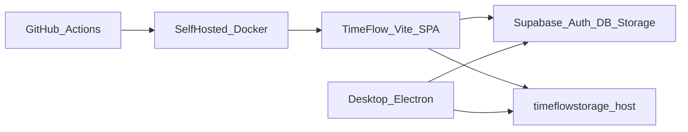

# TimeFlow Security Audit Report

| Field | Value |
|--------|--------|
| **Engagement type** | Report-only security audit (no remediation applied) |
| **Date** | 24 August 2026 |
| **Scope** | TimeFlow web (`TimeFlow/`), Electron desktop (`timeflow-desktop-app/`), Tracker Supabase project, GitHub Actions / on-prem Docker deploy, client contract for `timeflowstorage.mechlintech.com` |
| **Overall posture** | **Weak** |
| **Auditor method** | Static code review + live Supabase advisors/SQL inventory + dependency audit |

---

## 1. Executive summary

TimeFlow is a Vite/React SPA and Electron desktop client that talk **directly** to Supabase (Auth + PostgREST + Storage) and to an external screenshot/file host. There is **no application server** enforcing authorization; security depends almost entirely on Supabase RLS, grants, and Auth.

**Live database checks contradict the intended design.** Critical tables have RLS **policies defined but RLS itself disabled**, while `anon` / `authenticated` retain broad table privileges (including `SELECT`/`UPDATE`/`DELETE`/`TRUNCATE`). Combined with a **committed `service_role` key** and several privilege-bypass RPC patterns, the platform should be treated as **actively exposed** until Critical items are fixed and keys rotated.

### Rotate / act immediately

1. **Enable RLS** on `profiles`, `time_entries`, `project_time_entries`, `system_settings` (policies already exist).
2. **Rotate** the Tracker Supabase `service_role` key (and review JWT signing / API keys). Assume compromise of the key in `delete-sc/cleanup.js`.
3. **Revoke** execute on dangerous SECURITY DEFINER functions from `anon` (especially `backfill_screenshot_user_id_batch`, `get_user_id_by_email`).
4. **Purge** secrets from git history and stop shipping elevated keys in client or scripts.
5. **Audit** `timeflowstorage.mechlintech.com` authn/z (uploads appear unauthenticated from clients).

### Finding counts

| Severity | Count |
|----------|------:|
| Critical | 5 |
| High | 8 |
| Medium | 10 |
| Low / Informational | 6 |

---

## 2. Scope, methodology, and framework mapping

### In scope

- Web app: Vite 5 + React 18 SPA (`timeflow.mechlintech.com`)
- Desktop: Electron 28 tracker app
- Supabase project `yxkniwzsinqyjdqqzyjs` (live advisors + SQL)
- CI/CD: `.github/workflows/deployment.yml` (self-hosted Docker), `deploy.yml` (GitHub Pages)
- External storage host as used by clients (server source **not** in repo)

### Out of scope

- Formal pen test / social engineering
- Other Mechlin apps (except HRMS client usage from Attendance)
- Implementing fixes in this engagement

### Control framework (tailored, not certification)

| Framework | Use in this audit |
|-----------|-------------------|
| **OWASP ASVS L2** | Primary control backbone |
| **OWASP Top 10 / API Top 10** | Finding tags for readability |
| **Supabase security model** | First-class domain (RLS, grants, DEFINER, service_role, Storage) |
| **GitHub security practices** | Workflows, secrets, self-hosted runner |
| **CIS Controls (selected)** | Secret hygiene, hardening, logging — not full CIS |

No claim of formal ASVS/CIS compliance.

### Architecture (threat model)



**Trust boundary note:** Browser and Electron both hold the publishable anon key. Any gap in RLS/grants/RPC is reachable by anyone who can obtain that key (it is public by design and also hardcoded in source).

### Checks performed

- Static review of auth, AdminPanel, storage clients, Electron `webPreferences`, OAuth callback, Docker/nginx, workflows
- Live Supabase: `get_advisors` (security), RLS flags, `pg_policies`, grants, SECURITY DEFINER inventory, storage buckets/policies
- `npm audit --omit=dev` on web and desktop

---

## 3. Findings summary

| ID | Severity | Title | Primary mappings |
|----|----------|-------|------------------|
| C-01 | Critical | RLS disabled on core public tables with full `anon` grants | ASVS V4, A01, API1, Supabase RLS |
| C-02 | Critical | `service_role` JWT committed in repository | ASVS V2/V14, A02, Supabase service_role |
| C-03 | Critical | `get_user_id_by_email` DEFINER exposes Auth users to `anon` | ASVS V4, A01, API3, Supabase |
| C-04 | Critical | `backfill_screenshot_user_id_batch` DEFINER callable by `anon` without auth gate | ASVS V4, A01, Supabase |
| C-05 | Critical | Storage object policies allow broad public read / open insert | ASVS V4/V12, A01, Supabase Storage |
| H-01 | High | OAuth open callback + tokens in query string | ASVS V2/V3, A01/A07 |
| H-02 | High | Electron `nodeIntegration` / no `contextIsolation` | ASVS V5/V14, desktop hardening |
| H-03 | High | Unauthenticated uploads to `timeflowstorage.mechlintech.com` | ASVS V4/V12, API2 |
| H-04 | High | `supabase.auth.admin.*` invoked from browser client | ASVS V4, A01, Supabase Auth |
| H-05 | High | Hardcoded anon keys (Tracker + HRMS) in source and docs | ASVS V14, secret hygiene |
| H-06 | High | Client-only admin UI gate; DB must enforce (currently broken by C-01) | ASVS V4, A01 |
| H-07 | High | Over-permissive notifications insert (`WITH CHECK (true)`) | ASVS V4, A01 |
| H-08 | High | Web npm: critical/high advisories (jsPDF, react-router, etc.) | ASVS V14, A06 |
| M-01 | Medium | No security headers (CSP/HSTS/XFO) on nginx | ASVS V14, A05 |
| M-02 | Medium | `.env` not ignored in web `.gitignore` | ASVS V14, GitHub hygiene |
| M-03 | Medium | Self-hosted runner + DockerHub secrets; keys as build-args | CIS/GitHub Actions |
| M-04 | Medium | Dual deploy paths (Pages + Docker) expand attack surface | GitHub / config |
| M-05 | Medium | Cross-project HRMS Supabase client from Attendance | ASVS V4, least privilege |
| M-06 | Medium | Password login path still present (`/login/direct`) | ASVS V2 |
| M-07 | Medium | Many DEFINER helpers executable by `anon`; mutable `search_path` | Supabase advisors |
| M-08 | Medium | Projects/tasks SELECT policies use `true` (org-wide visibility) | ASVS V4 |
| M-09 | Medium | Desktop `app_versions` SQL allows any authenticated ALL | ASVS V4 |
| M-10 | Medium | Desktop npm high advisories (sharp, ws, minimatch) | ASVS V14 |
| L-01 | Low | Public buckets `avatars`, `tracker-application` | Informational / review |
| L-02 | Low | Console logging of OAuth callback details | ASVS V7 |
| L-03 | Low | Screenshot paths / ~1.9M screenshot rows — privacy sensitivity | Privacy |
| L-04 | Low | Branch-name workflow only; no dependency review / CodeQL observed | GitHub |
| L-05 | Info | SPA architecture: anon key in client is expected if RLS is correct | — |
| L-06 | Info | Admin-gated DEFINER log readers (`get_supabase_api_logs`, etc.) are better patterns | Positive |

---

## 4. Finding details

### C-01 — RLS disabled on core tables (Critical)

**Evidence (live):** Supabase security advisors report `policy_exists_rls_disabled` and `rls_disabled_in_public` for:

- `public.profiles` (~72 rows)
- `public.time_entries` (~15,277 rows)
- `public.project_time_entries`
- `public.system_settings`

Confirmed: `relrowsecurity = false` while policies exist. Grants show **`anon` and `authenticated` have SELECT, INSERT, UPDATE, DELETE, TRUNCATE** on these tables.

**Impact:** Anyone with the public anon key (hardcoded in the apps) can read/modify/delete employee profiles, all time entries, and system settings via PostgREST — **without signing in**. This is a full break of the access-control model.

**Remediation:** Immediately `ALTER TABLE … ENABLE ROW LEVEL SECURITY` (and consider `FORCE ROW LEVEL SECURITY`) on all four tables; re-test app flows; revoke unnecessary privileges from `anon` (prefer no direct table access for anonymous users). Effort: **S** for enable; **M** for full grant/policy cleanup and regression test.

---

### C-02 — Service role key committed (Critical)

**Evidence:** `TimeFlow/delete-sc/cleanup.js` embeds a JWT with `"role":"service_role"` for project `yxkniwzsinqyjdqqzyjs`.

**Impact:** Service role **bypasses RLS**. Anyone with repo access (or historical clones/forks/CI logs) can fully administer the database and Auth. Treat as compromised.

**Remediation:** Rotate service_role / API keys in Supabase Dashboard; remove key from repo; load from env/secret manager; scrub git history (`git filter-repo` / BFG) if ever pushed; audit Auth users and unusual admin API usage. Effort: **S–M**.

---

### C-03 — Email → user ID enumeration via DEFINER (Critical)

**Evidence:** Live function:

```sql
-- public.get_user_id_by_email(user_email text) SECURITY DEFINER
-- SELECT id FROM auth.users WHERE email = user_email;
-- ACL includes anon=X
```

**Impact:** Unauthenticated callers can map emails to UUIDs (user existence / correlation), aiding targeted attacks.

**Remediation:** `REVOKE EXECUTE … FROM anon, public`; restrict to `service_role` or a tightly gated Edge Function; add auth checks if retained. Effort: **S**.

---

### C-04 — Unauthenticated batch backfill DEFINER (Critical)

**Evidence:** `backfill_screenshot_user_id_batch` is SECURITY DEFINER, updates `screenshots`, **no `auth.uid()` check**, execute granted to `anon` / `authenticated`.

**Impact:** Anonymous callers can trigger privileged bulk updates (DoS / data integrity risk on ~1.9M screenshot rows).

**Remediation:** Revoke from `anon`/`authenticated`; grant only `service_role`; or delete after migration complete. Effort: **S**.

---

### C-05 — Overly permissive Storage policies (Critical)

**Evidence (live `storage` policies):**

- Objects SELECT: `Allow Public Read for Updates` with `qual: true` for `{anon,authenticated}`
- Objects INSERT: authenticated with `with_check: true`
- Buckets INSERT: includes `anon` with `with_check: true`

Buckets: `screenshots` (private flag), `avatars` (public), `tracker-application` (public).

**Impact:** Policy `qual/with_check true` undermines path-scoped ownership. Risk of unauthorized read/upload across buckets depending on how policies combine.

**Remediation:** Replace with path-prefixed policies (`(storage.foldername(name))[1] = auth.uid()::text` pattern); restrict anon; review public buckets intentionally. Effort: **M**.

---

### H-01 — Open OAuth callback + tokens in URL (High)

**Evidence:** `TimeFlow/src/pages/Login.tsx` stores arbitrary `?callback=` in `sessionStorage`. `App.tsx` `buildCallbackRedirectUrl` redirects to that URL with `access_token` and `refresh_token` query params (custom protocol or HTTP).

**Impact:** Attacker-controlled callback can steal session tokens (open redirect / token leakage via Referer, logs, history). Desktop `tracker://` and `localhost:5174` flows inherit this design.

**Remediation:** Allowlist callback URLs (`tracker://callback`, exact localhost origin/path); prefer one-time code handoff instead of raw tokens in URLs; never accept arbitrary absolute URLs. Effort: **M**.

---

### H-02 — Insecure Electron webPreferences (High)

**Evidence:** `timeflow-desktop-app/main.js`:

- `nodeIntegration: true`
- `contextIsolation: false`
- `enableRemoteModule: true` (main window)

**Impact:** Any XSS or malicious content in the renderer can reach Node APIs (RCE-class on employee machines), undermining OS isolation.

**Remediation:** Enable `contextIsolation`, disable `nodeIntegration`, use a preload with explicit `contextBridge` IPC; remove remote module. Effort: **L**.

---

### H-03 — Unauthenticated media uploads (High)

**Evidence:**

- Web: `TimeFlow/src/lib/timeflowStorage.ts` — `POST` FormData to `/upload` with **no Authorization header**
- Desktop: `renderer.js` `uploadBufferToScreenshotServer` — same pattern

**Impact (client-visible):** If the storage server does not independently authenticate (not verified in-repo), anyone who can reach the host can upload/overwrite objects under chosen `type`/`uuid` paths; file URLs are guessable query params.

**Remediation:** Require Supabase JWT (or signed upload URL) on the storage server; validate `uuid` matches token subject; rate-limit; private file URLs with short-lived signatures. Effort: **M–L** (server + clients).

---

### H-04 — Auth Admin API from browser (High)

**Evidence:** `TimeFlow/src/pages/AdminPanel.tsx` calls `supabase.auth.admin.createUser`, `deleteUser`, `updateUserById`, `generateLink` using the shared browser client (anon key).

**Impact:** Admin Auth APIs require service role. Either these calls fail in production (broken admin UX) or an elevated key was/is exposed to the client (Critical). Pattern is unsafe either way.

**Remediation:** Move user provisioning to a server-side Edge Function / admin backend with service role; never call `auth.admin` from SPA. Effort: **M**.

---

### H-05 — Hardcoded publishable keys (High)

**Evidence:** Fallback JWTs in `TimeFlow/src/lib/supabase.ts` (Tracker + HRMS), `SETUP.md`, `timeflow-desktop-app/renderer.js`.

**Impact:** Keys cannot be rotated without a code release; documents proliferate secrets; couples desktop binaries to a specific project forever. Anon keys are “public” but still should come from env/build config only.

**Remediation:** Remove hardcoded fallbacks; env-only; rotate anon keys if leaked beyond intended apps; fix desktop packaging to inject at build time. Effort: **S–M**.

---

### H-06 — UI-only admin authorization (High)

**Evidence:** `App.tsx` gates `/admin` with `user.role === 'admin'` only.

**Impact:** With C-01, role in `profiles` is not enforced by RLS; attackers can escalate or bypass UI. Even with RLS fixed, UI gates must never be the only control.

**Remediation:** Fix C-01; ensure admin mutations require `is_admin(auth.uid())` policies / RPC checks; optionally hide routes but always enforce in DB. Effort: covered largely by C-01 + policy review.

---

### H-07 — Notifications insert policy (High)

**Evidence:** Live policy `System can create notifications` — `INSERT` for authenticated with `with_check: true`.

**Impact:** Any logged-in user can insert arbitrary notifications for any `user_id` (spam / phishing inside the product).

**Remediation:** Restrict insert to service_role / security definer trigger; or `WITH CHECK (auth.uid() = user_id)` for self-only. Effort: **S**.

---

### H-08 — Web dependency vulnerabilities (High)

**Evidence:** `npm audit --omit=dev` on TimeFlow reported **6** issues including **1 critical** (jsPDF PDF injection / JS execution advisories) and **4 high** (react-router XSS/open-redirect class, etc.), **1 moderate** (DOMPurify).

**Remediation:** `npm audit fix` / upgrade `jspdf`, `react-router-dom`, `dompurify` to patched versions; retest PDF export and routing. Effort: **S–M**.

---

### M-01 — Missing HTTP security headers (Medium)

**Evidence:** `TimeFlow/timeflow/Dockerfile` nginx config has no CSP, HSTS, `X-Frame-Options`, `X-Content-Type-Options`, `Referrer-Policy`.

**Remediation:** Add headers in nginx (start with frame denial, nosniff, strict referrer; phase CSP). Effort: **S**.

---

### M-02 — `.env` not gitignored (Medium)

**Evidence:** `TimeFlow/.gitignore` ignores only `.env.*.local` variants, not `.env`.

**Remediation:** Add `.env`, `.env.*`, keep `.env.example` without secrets. Effort: **S**.

---

### M-03 — Self-hosted CI/CD secrets (Medium)

**Evidence:** `deployment.yml` uses `runs-on: self-hosted`, DockerHub login, writes `.env` on runner, passes Supabase URL/anon as Docker **build-args** (baked into image layers), prunes Docker at end.

**Impact:** Compromised runner = deploy + secret access; image layers may retain build-time env; DockerHub token is high value.

**Remediation:** Harden runner OS/access; prefer runtime config for public anon only; ensure workflow `permissions` least privilege; protect main branch; avoid leaving `.env` on disk (partially cleaned). Effort: **M**.

---

### M-04 — Dual deployment (Medium)

**Evidence:** Both GitHub Pages (`deploy.yml`) and self-hosted Docker (`deployment.yml`) deploy from `main`.

**Impact:** Two production-like surfaces to secure (headers, secrets, redirect URLs).

**Remediation:** Document which is authoritative; disable unused pipeline; align Auth redirect allowlists. Effort: **S**.

---

### M-05 — Cross-project HRMS client (Medium)

**Evidence:** `hrmsSupabase` in `supabase.ts`; `Attendance.tsx` queries HRMS `users` / `leave_*` with embedded anon key.

**Impact:** TimeFlow users/browser can hit HRMS Data API subject to HRMS RLS quality (not audited here).

**Remediation:** Prefer server-side BFF with scoped token; audit HRMS RLS separately; remove hardcoded HRMS key. Effort: **M**.

---

### M-06 — Password login still exposed (Medium)

**Evidence:** Route `/login/direct` → `LoginDirect` password auth while primary UX is Azure SSO.

**Impact:** Broader credential-stuffing / password policy surface if not intended for production.

**Remediation:** Disable route in production or protect with network controls / feature flag. Effort: **S**.

---

### M-07 — DEFINER surface + mutable search_path (Medium)

**Evidence:** Advisors warn many SECURITY DEFINER functions executable by `anon`, and multiple functions with mutable `search_path` (`is_admin`, `is_manager`, etc.).

**Impact:** Increases privilege-escalation / search_path hijack risk; some functions are OK if they only return booleans, but execute should still be minimized.

**Remediation:** `REVOKE` from `anon` where not required; `SET search_path = public` (fixed) on all DEFINER functions; keep admin checks inside sensitive RPCs (as done in `get_supabase_api_logs`). Effort: **M**.

---

### M-08 — Org-wide SELECT on projects/tasks (Medium)

**Evidence:** Policies `Everyone can view projects` / `Everyone can read tasks` use `qual: true`.

**Impact:** Any authenticated (and depending on grants, possibly broader) user sees all projects/tasks — may be intentional for this org; confirm against data classification.

**Remediation:** If not intentional, restrict to membership tables. Effort: **S–M**.

---

### M-09 — Desktop version-management SQL over-broad (Medium)

**Evidence:** `timeflow-desktop-app/migration-version-management.sql` policy: authenticated users `FOR ALL` on `app_versions`.

**Impact:** If applied as-written in an environment, any user could alter force-update / download URLs (supply-chain risk for the desktop app).

**Remediation:** Restrict writes to admin; verify live policy state for version tables. Effort: **S**.

---

### M-10 — Desktop dependency advisories (Medium)

**Evidence:** Desktop `npm audit` reported high issues in `sharp`, `ws`, `minimatch`/`brace-expansion` (transitive).

**Remediation:** Upgrade Electron toolchain dependencies carefully; retest screenshot pipeline. Effort: **M**.

---

### L-01 … L-06 — Lower / informational

- Public buckets may be intentional for avatars/installers — confirm.
- OAuth debug `console.log` in `App.tsx` may leak callback metadata in shared machines.
- ~1.9M screenshots + webcam/camera types = high privacy sensitivity; retention policy recommended.
- No CodeQL / dependency-review workflow observed.
- SPA anon key pattern is acceptable **only if** RLS/grants are correct (currently not).
- Positive: `get_supabase_api_logs` / `get_tracker_crud_logs` use DEFINER **with** `is_admin` checks.

---

## 5. ASVS-oriented control coverage matrix

| ASVS domain | Rating | Notes |
|-------------|--------|-------|
| V1 Architecture | **Fail** | No server trust layer; all authz at Supabase |
| V2 Authentication | **Partial** | Azure SSO + PKCE good; password path; token-in-URL handoff |
| V3 Session | **Partial** | Client storage sessions; token leakage via redirects |
| V4 Access control | **Fail** | RLS disabled on core tables; DEFINER/storage gaps |
| V5 Validation / XSS | **Partial** | No `dangerouslySetInnerHTML` found; Electron XSS = RCE |
| V6 Crypto | **N/A / Partial** | Relies on TLS + Supabase; no app-level crypto review |
| V7 Error / logging | **Partial** | Audit RPCs exist; verbose client auth logs |
| V8 Data protection | **Fail** | PII/time/screenshots exposed if C-01/C-05 hold |
| V9 Communication | **Partial** | HTTPS assumed at edge; nginx lacks HSTS in container |
| V10 Malicious code | **Partial** | Dependency advisories present |
| V12 Files / media | **Fail** | Unauthenticated upload client; weak storage policies |
| V13 API | **Fail** | PostgREST effectively open on key tables |
| V14 Config | **Fail** | Secrets in repo; missing headers; gitignore gap |

---

## 6. Domain posture snapshot

| Domain | Posture |
|--------|---------|
| Supabase RLS / grants | **Critical weakness** |
| Secrets / key handling | **Critical weakness** |
| AuthN (SSO/PKCE) | Developing |
| AuthZ (app + DB) | **Critical weakness** |
| Electron hardening | Weak |
| External storage | Weak (unverified server) |
| CI/CD / on-prem deploy | Developing |
| Dependency hygiene | Developing |
| HTTP hardening | Weak |

---

## 7. Prioritized remediation roadmap (advisory only)

### 0–7 days (break-glass)

1. Enable RLS (+ FORCE if needed) on `profiles`, `time_entries`, `project_time_entries`, `system_settings`.
2. Rotate Supabase `service_role` (and review anon keys); remove from `delete-sc/cleanup.js`.
3. `REVOKE EXECUTE` on `get_user_id_by_email`, `backfill_screenshot_user_id_batch` from `anon`/`authenticated`.
4. Tighten Storage policies; verify anonymous cannot list/read private objects.
5. Confirm whether AdminPanel admin APIs work in prod; if yes, treat as incident.

### 8–30 days

6. Allowlist OAuth callbacks; stop putting refresh/access tokens in URLs.
7. Authenticate `timeflowstorage` uploads/downloads.
8. Move Auth Admin operations to Edge Functions / backend.
9. Remove hardcoded keys; fix `.gitignore`; scrub history if required.
10. Add nginx security headers; patch npm critical/high issues.
11. Restrict notifications insert; review projects/tasks visibility.

### 31–90 days

12. Electron security rewrite (`contextIsolation`, preload IPC).
13. Systematic DEFINER/`search_path`/grant cleanup; re-run Supabase advisors to zero ERROR.
14. CI: pin actions, branch protection, optional CodeQL/dependabot; harden self-hosted runner.
15. Data retention for screenshots; privacy review.
16. Repeat audit / light pen test focusing on PostgREST + storage host.

---

## 8. Appendix

### A. Positive observations

- PKCE explicitly enabled for OAuth on web.
- Screenshot RLS policies (when RLS is enabled) show thoughtful admin/manager/own splits.
- Some admin log RPCs correctly gate on `is_admin(auth.uid())`.
- Docker multi-stage build separates Node build from nginx runtime.
- GitHub Pages workflow uses limited `permissions` block.

### B. Live advisor ERROR themes (Tracker project)

- `policy_exists_rls_disabled` / `rls_disabled_in_public` on four tables (C-01)
- Extensive WARN: `function_search_path_mutable`, `anon_security_definer_function_executable`, `authenticated_security_definer_function_executable`

### C. Data volumes (impact context)

| Table / asset | Approx. count |
|---------------|---------------:|
| profiles | 72 |
| time_entries | 15,277 |
| screenshots | 1,899,135 |

### D. Key file references

| Area | Path |
|------|------|
| Supabase clients / keys | `TimeFlow/src/lib/supabase.ts` |
| OAuth callback / tokens | `TimeFlow/src/App.tsx`, `Login.tsx` |
| Admin Auth API | `TimeFlow/src/pages/AdminPanel.tsx` |
| Service role script | `TimeFlow/delete-sc/cleanup.js` |
| Storage upload (web) | `TimeFlow/src/lib/timeflowStorage.ts` |
| Nginx / Docker | `TimeFlow/timeflow/Dockerfile` |
| Self-hosted deploy | `TimeFlow/.github/workflows/deployment.yml` |
| Electron prefs | `timeflow-desktop-app/main.js` |
| Desktop upload / key | `timeflow-desktop-app/renderer.js` |

### E. Exclusions / limitations

- Screenshot storage **server** source not reviewed; findings H-03/C-05 mark client-visible risk.
- No authenticated end-to-end exploit demonstration was run against production (read-only inventory + static analysis).
- HRMS Supabase project RLS not audited.
- Branch protection / org GitHub settings not fully verified via API.

### F. Document control

| Version | Date | Notes |
|---------|------|-------|
| 1.0 | 2026-08-24 | Initial report-only audit |
| 1.1 | 2026-08-24 | Remediation implemented (see Appendix G) |

---

## Appendix G — Remediation status (2026-08-24)

Supabase security advisors after remediation: **0 ERROR** (WARN remain for leftover DEFINER execute / search_path on non-critical helpers).

| ID | Status | Notes |
|----|--------|-------|
| C-01 | **Fixed** | RLS + FORCE enabled on profiles, time_entries, project_time_entries, system_settings; anon table grants revoked |
| C-02 | **Mitigated / Owner-action** | service_role removed from `delete-sc/cleanup.js`; **rotate key in Dashboard** per [KEY_ROTATION.md](KEY_ROTATION.md); scrub git history if pushed |
| C-03 | **Fixed** | `get_user_id_by_email` execute revoked from anon/authenticated |
| C-04 | **Fixed** | `backfill_screenshot_user_id_batch` execute service_role only |
| C-05 | **Fixed** | Storage policies path-scoped; public read limited to avatars + tracker-application |
| H-01 | **Fixed** | OAuth callback allowlist (`oauthCallbackAllowlist.ts`); verbose token logs removed |
| H-02 | **Fixed** | Electron `contextIsolation: true`, `nodeIntegration: false`, preload bridges |
| H-03 | **Mitigated / Owner-action** | Clients send Bearer JWT; deploy server middleware per [docs/STORAGE_SERVER_AUTH.md](docs/STORAGE_SERVER_AUTH.md) |
| H-04 | **Fixed** | `admin-users` Edge Function deployed; AdminPanel uses `callAdminUsers` (no browser `auth.admin`) |
| H-05 | **Fixed** | Hardcoded anon/HRMS keys removed; env-only + `.env.example` |
| H-06 | **Fixed** | UI gate retained; DB RLS + admin Edge Function enforce |
| H-07 | **Fixed** | Notifications insert tightened; `create_notification_for_user` RPC |
| H-08 | **Mitigated** | react-router-dom / jspdf upgraded; re-run `npm audit` in CI |
| M-01 | **Fixed** | nginx security headers + CSP in Dockerfile |
| M-02 | **Fixed** | `.gitignore` ignores `.env` |
| M-03 | **Mitigated** | workflow `permissions: contents: read`; `.env` file step removed; [docs/RUNNER_HARDENING.md](docs/RUNNER_HARDENING.md) |
| M-04 | **Fixed** | GitHub Pages deploy is manual `workflow_dispatch` only; Docker is authoritative |
| M-05 | **Mitigated** | HRMS keys env-only; null-guard; separate HRMS RLS audit still recommended |
| M-06 | **Fixed** | `/login/direct` only in `import.meta.env.DEV` |
| M-07 | **Mitigated** | search_path set + anon revoke on core helpers; some WARN remain |
| M-08 | **Fixed** | Projects SELECT membership-scoped; tasks authenticated; anon revoked |
| M-09 | **Fixed** | Desktop SQL: admin-only manage on `app_versions` |
| M-10 | **Mitigated** | sharp upgraded where applied |
| L-01 | **Accepted** | Public avatars / tracker-application intentional |
| L-02 | **Fixed** | OAuth debug logs removed |
| L-03 | **Mitigated** | [docs/SCREENSHOT_RETENTION.md](docs/SCREENSHOT_RETENTION.md) |
| L-04 | **Fixed** | Dependabot + `security-checks.yml` npm audit on PRs |
| L-05 | **Info** | Anon key in SPA OK with RLS fixed |
| L-06 | **Info** | Positive pattern retained |

**Owner must still:** rotate Supabase service_role (and update CI secrets), deploy storage JWT middleware, confirm desktop `.env` on build machines, optionally purge git history.

---

**Recommendation:** Complete owner-action items above, then re-verify admin user create, time entry CRUD, screenshots, and desktop OAuth before declaring the incident closed.
