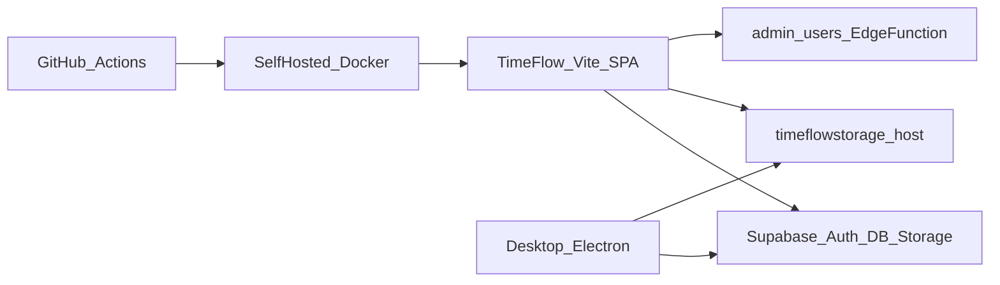

# TimeFlow Security Audit Report

| Field | Value |
|--------|--------|
| **Engagement type** | Re-verification security audit (report-only; no new remediation applied in this pass) |
| **Date** | 28 August 2026 |
| **Prior report** | v1.0 / v1.1 dated 24 August 2026 |
| **Scope** | TimeFlow web (`TimeFlow/`), Electron desktop (`timeflow-desktop-app/`), Tracker Supabase project, GitHub Actions / on-prem Docker deploy, client contract for `timeflowstorage.mechlintech.com` |
| **Overall posture** | **Improved (Moderate)** — Critical access-control break from v1.0 is closed; residual Medium/Low + owner-action items remain |
| **Auditor method** | Static code re-review + live Supabase advisors/SQL inventory + dependency audit |

---

## 1. Executive summary

TimeFlow remains a Vite/React SPA and Electron desktop client that talk **directly** to Supabase (Auth + PostgREST + Storage) and to an external screenshot/file host. There is still **no application server** enforcing authorization; security depends on Supabase RLS, grants, Auth, and Edge Functions.

**Re-verification (28 August 2026) confirms the Critical database exposure reported on 24 August is remediated in the live Tracker project.** Supabase security advisors now report **0 ERROR** (46 WARN remain). Core tables have RLS **enabled and FORCE**d; `anon` table grants on those tables are gone; dangerous DEFINER RPCs (`get_user_id_by_email`, `backfill_screenshot_user_id_batch`) are restricted to `service_role`; Storage policies are path-scoped; web/desktop clients no longer embed service/anon JWTs in source; Electron uses `contextIsolation`; Admin Auth APIs go through the `admin-users` Edge Function.

**Residual risk is no longer “actively open PostgREST.”** Remaining issues are hardening, owner operations, and dependency/platform hygiene:

1. **Confirm rotation** of the historically leaked Tracker `service_role` key (key removed from tree; Dashboard rotation is owner-owned — see [KEY_ROTATION.md](KEY_ROTATION.md)).
2. **Confirm** `timeflowstorage.mechlintech.com` enforces Bearer JWT middleware ([docs/STORAGE_SERVER_AUTH.md](docs/STORAGE_SERVER_AUTH.md)) — clients send tokens; server source still not in this repo.
3. **Upgrade Postgres** (advisor: `supabase-postgres-15.8.1.105` has outstanding patches).
4. **Reduce leftover DEFINER execute / mutable `search_path` WARNs**; patch desktop npm highs (`ws`, `minimatch`/`brace-expansion`).
5. **Prefer code-based desktop OAuth handoff** instead of putting access/refresh tokens in allowlisted callback query strings (H-01 residual).

### Finding counts (residual open / partial)

| Severity | Original (v1.0) | Closed / accepted | Still open or partial |
|----------|----------------:|------------------:|----------------------:|
| Critical | 5 | 5 closed or mitigated pending owner rotate | 0 Critical open in live DB |
| High | 8 | 6 fixed; 2 mitigated (owner-action / residual design) | 2 partial |
| Medium | 10 | 7 fixed; 3 mitigated | 3 residual themes + new platform WARNs |
| Low / Info | 6 | mostly closed / accepted | 2–3 residual |
| **New (v1.2)** | — | — | Postgres patch, Auth OTP/HIBP, desktop npm high |

---

## 2. Scope, methodology, and framework mapping

### In scope

- Web app: Vite 5 + React 18 SPA (`timeflow.mechlintech.com`)
- Desktop: Electron 28 tracker app
- Supabase project `yxkniwzsinqyjdqqzyjs` (live advisors + SQL as of 28 Aug 2026)
- CI/CD: `.github/workflows/deployment.yml` (self-hosted Docker), `deploy.yml` (GitHub Pages), `security-checks.yml`
- External storage host as used by clients (server source **not** in repo)

### Out of scope

- Formal pen test / social engineering
- Other Mechlin apps (except HRMS client usage from Attendance)
- Implementing new fixes in this re-verification pass
- Proving storage-server JWT enforcement remotely beyond client contract review

### Control framework (tailored, not certification)

| Framework | Use in this audit |
|-----------|-------------------|
| **OWASP ASVS L2** | Primary control backbone |
| **OWASP Top 10 / API Top 10** | Finding tags for readability |
| **Supabase security model** | First-class domain (RLS, grants, DEFINER, service_role, Storage) |
| **GitHub security practices** | Workflows, secrets, self-hosted runner |
| **CIS Controls (selected)** | Secret hygiene, hardening, logging — not full CIS |

No claim of formal ASVS/CIS compliance.

### Architecture (threat model)

**Trust boundary note:** Browser and Electron hold the publishable anon key (env/build-injected). With RLS/FORCE and grants corrected, anon-key possession alone no longer grants unrestricted table access. Edge Function `admin-users` holds elevated Auth operations server-side.

### Checks performed (v1.2)

- Re-review of auth allowlist, AdminPanel → `callAdminUsers`, storage clients, Electron `webPreferences`/preload, Docker/nginx headers, workflows, `.gitignore`, cleanup script
- Live Supabase: `get_advisors` (security), RLS/FORCE flags, grants, SECURITY DEFINER ACLs, storage policies, notifications/projects policies, Edge Functions list, row counts
- `npm audit --omit=dev` on web and desktop (28 Aug 2026)

---

## 3. Findings summary (original IDs retained)

| ID | Severity | Title | v1.2 status |
|----|----------|-------|-------------|
| C-01 | Critical | RLS disabled on core public tables with full `anon` grants | **Fixed (verified live)** |
| C-02 | Critical | `service_role` JWT committed in repository | **Mitigated — owner must confirm rotation** |
| C-03 | Critical | `get_user_id_by_email` DEFINER exposes Auth users to `anon` | **Fixed (verified live)** |
| C-04 | Critical | `backfill_screenshot_user_id_batch` DEFINER callable by `anon` | **Fixed (verified live)** |
| C-05 | Critical | Storage object policies allow broad public read / open insert | **Fixed (verified live)** |
| H-01 | High | OAuth open callback + tokens in query string | **Partially fixed** (allowlist yes; tokens still in URL) |
| H-02 | High | Electron `nodeIntegration` / no `contextIsolation` | **Fixed (code verified)** |
| H-03 | High | Unauthenticated uploads to `timeflowstorage.mechlintech.com` | **Mitigated — owner must confirm server** |
| H-04 | High | `supabase.auth.admin.*` invoked from browser client | **Fixed** (`admin-users` Edge Function ACTIVE) |
| H-05 | High | Hardcoded anon keys (Tracker + HRMS) in source and docs | **Fixed** (env-only; no JWT blobs in tree) |
| H-06 | High | Client-only admin UI gate | **Fixed** (RLS + Edge Function enforce) |
| H-07 | High | Over-permissive notifications insert (`WITH CHECK (true)`) | **Fixed (verified live)** |
| H-08 | High | Web npm critical/high advisories | **Fixed** (web `npm audit`: **0** vulnerabilities) |
| M-01 | Medium | No security headers on nginx | **Mostly fixed** (CSP/XFO/nosniff/Referrer; **no HSTS** yet) |
| M-02 | Medium | `.env` not ignored in web `.gitignore` | **Fixed** |
| M-03 | Medium | Self-hosted runner + DockerHub secrets; keys as build-args | **Mitigated** (still self-hosted + build-args for public anon) |
| M-04 | Medium | Dual deploy paths | **Fixed** (Pages manual; Docker authoritative) |
| M-05 | Medium | Cross-project HRMS Supabase client | **Mitigated** (env-only; HRMS RLS still out of scope) |
| M-06 | Medium | Password login path still present | **Fixed** (`/login/direct` DEV-only) |
| M-07 | Medium | Many DEFINER helpers executable by `anon`; mutable `search_path` | **Partial** (core fixed; **46 WARN** remain) |
| M-08 | Medium | Projects/tasks SELECT policies use `true` | **Mostly fixed** (projects membership-scoped; tasks still `true` for authenticated) |
| M-09 | Medium | Desktop `app_versions` SQL over-broad | **Fixed** (admin-only manage in SQL artifact) |
| M-10 | Medium | Desktop npm high advisories | **Open** (3 high: `ws`, `minimatch`, `brace-expansion`) |
| L-01 | Low | Public buckets `avatars`, `tracker-application` | **Accepted** |
| L-02 | Low | Console logging of OAuth callback details | **Fixed** |
| L-03 | Low | Screenshot volume / privacy sensitivity | **Mitigated** (retention doc; ~1.95M rows) |
| L-04 | Low | No dependency review / CodeQL | **Partially fixed** (Dependabot + `security-checks.yml`; no CodeQL) |
| L-05 | Info | SPA anon key expected if RLS correct | **Info — now consistent with live RLS** |
| L-06 | Info | Admin-gated DEFINER log readers | **Positive retained** |
| N-01 | Medium | Postgres version has outstanding security patches | **New (v1.2)** |
| N-02 | Low | Auth OTP expiry > 1 hour | **New (v1.2)** |
| N-03 | Low | Leaked-password protection (HIBP) disabled | **New (v1.2)** |

---

## 4. Finding details

### C-01 — RLS disabled on core tables (Critical) — FIXED

**v1.0 evidence:** `relrowsecurity = false` with policies present; `anon`/`authenticated` had SELECT/INSERT/UPDATE/DELETE/TRUNCATE.

**v1.2 live verification:**

| Table | RLS enabled | FORCE RLS |
|-------|-------------|-----------|
| `profiles` | true | true |
| `time_entries` | true | true |
| `project_time_entries` | true | true |
| `system_settings` | true | true |

`anon` no longer appears in `role_table_grants` for these four tables. `authenticated` retains DML privileges (expected) subject to RLS.

**Impact (historical):** Full anonymous PostgREST break. **Current:** Closed in live DB.

---

### C-02 — Service role key committed (Critical) — MITIGATED / OWNER-ACTION

**v1.2 evidence:** `delete-sc/cleanup.js` no longer embeds a JWT; `delete-sc/.env.example` documents env-based `SUPABASE_SERVICE_ROLE_KEY`. Repo-wide search for `eyJhbGci` under app sources: **no matches**. [KEY_ROTATION.md](KEY_ROTATION.md) checklist still requires Dashboard confirmation.

**Impact if not rotated:** Historical clones/forks may still hold a valid service_role JWT that bypasses RLS.

**Remediation (owner):** Rotate service_role in Dashboard; invalidate old key; update any CI/secret stores; optionally scrub git history. Effort: **S**.

---

### C-03 — Email → user ID enumeration via DEFINER (Critical) — FIXED

**v1.2 live:** `get_user_id_by_email` is SECURITY DEFINER; ACL **EXECUTE=service_role only** (not anon/authenticated).

**Residual:** Advisor still flags mutable `search_path` on this function — set `search_path` explicitly when convenient (M-07/N theme).

---

### C-04 — Unauthenticated batch backfill DEFINER (Critical) — FIXED

**v1.2 live:** `backfill_screenshot_user_id_batch` ACL **EXECUTE=service_role only**; `search_path=public` set.

---

### C-05 — Overly permissive Storage policies (Critical) — FIXED

**v1.2 live `storage.objects` policies (summary):**

- Public read limited to buckets `avatars` + `tracker-application`
- Screenshot read/upload/update/delete path-scoped to `auth.uid()` folder segments (or admin)
- Upload `WITH CHECK` requires own folder — not `true`

---

### H-01 — Open OAuth callback + tokens in URL (High) — PARTIAL

**Fixed:** `oauthCallbackAllowlist.ts` allowlists only `tracker://callback` and localhost/127.0.0.1 `:5174/callback`. Arbitrary `?callback=` values are rejected.

**Residual:** `App.tsx` still appends `access_token` and `refresh_token` as query parameters on allowlisted redirects for desktop handoff. Risk is reduced (no open redirect) but tokens can still appear in local process args, history, or Referer for HTTP localhost.

**Remediation:** Prefer one-time auth `code` handoff or loopback POST; keep allowlist. Effort: **M**.

---

### H-02 — Insecure Electron webPreferences (High) — FIXED

**v1.2 code:** `main.js` uses `contextIsolation: true`, `nodeIntegration: false`; `preload.js` exposes explicit bridges; `renderer.js` documents no Node `require()`.

---

### H-03 — Unauthenticated media uploads (High) — MITIGATED / OWNER-ACTION

**v1.2 clients:** Web `timeflowStorage.ts` and desktop `renderer.js` send `Authorization: Bearer <access_token>`.

**Unverified:** Whether production `timeflowstorage.mechlintech.com` rejects missing/invalid JWTs and binds `uuid` to token `sub` ([docs/STORAGE_SERVER_AUTH.md](docs/STORAGE_SERVER_AUTH.md)).

**Owner action:** Deploy/verify server middleware; rate-limit; prefer signed GET URLs.

---

### H-04 — Auth Admin API from browser (High) — FIXED

**v1.2:** `AdminPanel.tsx` uses `callAdminUsers`; Edge Function `admin-users` is **ACTIVE** with `verify_jwt: true`. No browser `supabase.auth.admin.*` calls.

---

### H-05 — Hardcoded publishable keys (High) — FIXED

**v1.2:** `supabase.ts` requires env vars (throws if missing); HRMS client env-only with null-guard; desktop loads config from env / remote config URL. No hardcoded JWTs found in current tree.

---

### H-06 — UI-only admin authorization (High) — FIXED

UI still gates `/admin` by `user.role === 'admin'`, but live RLS FORCE + Edge Function admin checks provide the real control plane.

---

### H-07 — Notifications insert policy (High) — FIXED

**v1.2 live:** Insert policy `Users can insert own notifications` with `WITH CHECK (user_id = auth.uid())`. Cross-user inserts go through `create_notification_for_user` (DEFINER) which requires auth and admin/manager/self.

**Residual:** Function remains executable by `anon` at ACL level but raises if `auth.uid()` is null — prefer `REVOKE` from `anon` (M-07 hygiene).

---

### H-08 — Web dependency vulnerabilities (High) — FIXED

**v1.2:** `npm audit --omit=dev` on TimeFlow web: **0 vulnerabilities**. CI workflow `security-checks.yml` runs audit on PRs/pushes.

---

### M-01 — Missing HTTP security headers (Medium) — MOSTLY FIXED

**v1.2 Dockerfile nginx:** `X-Frame-Options`, `X-Content-Type-Options`, `Referrer-Policy`, `Permissions-Policy`, CSP present.

**Residual:** No `Strict-Transport-Security` in container config (often set at TLS terminator — confirm at edge). Effort: **S**.

---

### M-02 — `.env` not gitignored (Medium) — FIXED

`.gitignore` includes `.env`, `.env.*`, with `!.env.example`.

---

### M-03 — Self-hosted CI/CD secrets (Medium) — MITIGATED

`deployment.yml`: `permissions: contents: read`; still `runs-on: self-hosted`; DockerHub login; anon URL/key still passed as Docker **build-args** (expected for SPA bake, but layers retain values). See [docs/RUNNER_HARDENING.md](docs/RUNNER_HARDENING.md).

---

### M-04 — Dual deployment (Medium) — FIXED

Docker/`deployment.yml` is authoritative; GitHub Pages path is manual `workflow_dispatch` only.

---

### M-05 — Cross-project HRMS client (Medium) — MITIGATED

Env-only HRMS keys; separate HRMS RLS audit still recommended (out of scope).

---

### M-06 — Password login still exposed (Medium) — FIXED

`/login/direct` mounted only when `import.meta.env.DEV`.

---

### M-07 — DEFINER surface + mutable search_path (Medium) — PARTIAL

**Progress:** Core dangerous RPCs revoked from anon; several helpers use fixed `search_path` and admin gates (e.g. `get_supabase_api_logs`).

**v1.2 advisors:** **46 WARN**, including ~15 anon-executable SECURITY DEFINER functions and ~9 mutable `search_path` functions (see Appendix B).

**Remediation:** Continue `REVOKE EXECUTE … FROM anon` where not required; `SET search_path` on remaining functions; keep authz checks inside sensitive RPCs. Effort: **M**.

---

### M-08 — Org-wide SELECT on projects/tasks (Medium) — MOSTLY FIXED

**Projects:** membership / creator / manager / admin scoped SELECT — verified live.

**Tasks:** policy `Authenticated users can read tasks` still `qual: true` — any authenticated user can read all tasks. Confirm intentional; otherwise scope to project membership. Effort: **S**.

---

### M-09 — Desktop version-management SQL (Medium) — FIXED

Desktop SQL artifact restricts manage rights to admin (per v1.1 remediation). Re-confirm live `app_versions` policies if that table exists in production.

---

### M-10 — Desktop dependency advisories (Medium) — OPEN

**v1.2 desktop `npm audit --omit=dev`:** **3 high** — `ws`, `minimatch`, `brace-expansion` (transitive via `glob`).

**Remediation:** `npm audit fix` / upgrade toolchain carefully; retest screenshot pipeline. Effort: **S–M**.

---

### L-01 … L-06 — Lower / informational

- Public avatars / tracker-application buckets: **accepted** intentional.
- OAuth debug logs: **removed**.
- Screenshots ~**1,950,365** rows — high privacy sensitivity; follow [docs/SCREENSHOT_RETENTION.md](docs/SCREENSHOT_RETENTION.md).
- Dependabot + npm audit workflow present; CodeQL still not observed.
- Anon key in SPA is acceptable **with current live RLS**.
- Positive: admin log RPCs gate on `is_admin(auth.uid())`.

---

### N-01 — Vulnerable Postgres version (Medium, new)

**Evidence:** Advisor `vulnerable_postgres_version` — `supabase-postgres-15.8.1.105` has outstanding security patches.

**Remediation:** Schedule Supabase/Postgres upgrade per [platform upgrade docs](https://supabase.com/docs/guides/platform/upgrading). Effort: **M** (maintenance window).

---

### N-02 — Auth OTP long expiry (Low, new)

**Evidence:** Email OTP expiry configured **> 1 hour**.

**Remediation:** Set OTP expiry under one hour in Auth settings. Effort: **S**.

---

### N-03 — Leaked password protection disabled (Low, new)

**Evidence:** HaveIBeenPwned leaked-password protection disabled in Auth.

**Remediation:** Enable in Supabase Auth password security settings (relevant while password/`LoginDirect` exists in DEV and any password users remain). Effort: **S**.

---

## 5. ASVS-oriented control coverage matrix

| ASVS domain | v1.0 | v1.2 | Notes |
|-------------|------|------|-------|
| V1 Architecture | Fail | **Partial** | Still no BFF; Edge Function for admin Auth improves trust split |
| V2 Authentication | Partial | **Partial** | SSO/PKCE good; OTP/HIBP WARNs; DEV password route |
| V3 Session | Partial | **Partial** | Allowlisted desktop handoff; tokens still in query string |
| V4 Access control | Fail | **Pass (core)** | RLS+FORCE verified; residual DEFINER/tasks SELECT |
| V5 Validation / XSS | Partial | **Improved** | Electron isolation fixed |
| V6 Crypto | N/A / Partial | Same | Relies on TLS + Supabase |
| V7 Error / logging | Partial | **Partial** | Admin log RPCs; less client OAuth noise |
| V8 Data protection | Fail | **Improved** | Core tables protected; screenshot privacy remains |
| V9 Communication | Partial | **Improved** | CSP/XFO present; confirm HSTS at edge |
| V10 Malicious code | Partial | **Improved** | Web clean; desktop highs remain |
| V12 Files / media | Fail | **Partial** | Storage RLS fixed; storage host JWT unverified |
| V13 API | Fail | **Improved** | PostgREST no longer anonymously open on core tables |
| V14 Config | Fail | **Improved** | Secrets out of tree; gitignore; CI audit |

---

## 6. Domain posture snapshot

| Domain | v1.0 | v1.2 |
|--------|------|------|
| Supabase RLS / grants | Critical weakness | **Strong (core)** |
| Secrets / key handling | Critical weakness | **Improved** (rotation confirmation pending) |
| AuthN (SSO/PKCE) | Developing | Developing+ |
| AuthZ (app + DB) | Critical weakness | **Strong (core)** |
| Electron hardening | Weak | **Improved** |
| External storage | Weak | Mitigated client-side; server TBD |
| CI/CD / on-prem deploy | Developing | Developing+ |
| Dependency hygiene | Developing | Web good; desktop residual |
| HTTP hardening | Weak | Improved (confirm HSTS) |
| Platform / Auth settings | — | Postgres patch + OTP/HIBP WARNs |

---

## 7. Prioritized remediation roadmap (advisory only)

### Still open — 0–7 days

1. Confirm **service_role rotation** complete ([KEY_ROTATION.md](KEY_ROTATION.md)).
2. Confirm **storage server** JWT middleware live and rejecting unauthenticated uploads.
3. Schedule **Postgres upgrade** for security patches (N-01).
4. Patch desktop npm highs (M-10).
5. Set Auth OTP expiry &lt; 1h; enable leaked-password protection (N-02, N-03).

### 8–30 days

6. Replace token-in-URL desktop OAuth handoff with code/POST pattern (H-01 residual).
7. `REVOKE` unnecessary DEFINER execute from `anon`; fix remaining mutable `search_path` (M-07).
8. Decide whether tasks org-wide SELECT is intentional; otherwise membership-scope (M-08 residual).
9. Add/confirm HSTS at TLS edge (M-01 residual).
10. Optional: CodeQL / dependency-review workflow.

### 31–90 days

11. Drive Supabase advisors toward zero WARN on DEFINER/search_path.
12. Screenshot retention enforcement / privacy review (L-03).
13. Light pen test focused on PostgREST policies + storage host + Edge Functions.
14. Re-audit after Postgres upgrade and storage-server confirmation.

---

## 8. Appendix

### A. Positive observations (v1.2)

- Live advisors: **0 ERROR** (was multiple ERROR on RLS-disabled tables).
- RLS + FORCE on profiles / time_entries / project_time_entries / system_settings.
- Path-scoped Storage policies; public read limited to intentional buckets.
- `admin-users` Edge Function deployed with JWT verification.
- Electron contextIsolation + preload bridge.
- Web production dependency audit clean; Dependabot + `security-checks.yml`.
- PKCE OAuth; callback allowlist; DEV-only password login.
- nginx CSP and common security headers in Docker image.

### B. Live advisor WARN themes (Tracker project, 28 Aug 2026)

| Advisor | Count | Notes |
|---------|------:|-------|
| `authenticated_security_definer_function_executable` | 19 | Includes role helpers + some log RPCs (admin-gated in body) |
| `anon_security_definer_function_executable` | 15 | Revoke where not required |
| `function_search_path_mutable` | 9 | Includes `get_user_id_by_email`, triggers/helpers |
| `auth_otp_long_expiry` | 1 | N-02 |
| `auth_leaked_password_protection` | 1 | N-03 |
| `vulnerable_postgres_version` | 1 | N-01 |
| **ERROR** | **0** | — |

### C. Data volumes (impact context, 28 Aug 2026)

| Table / asset | Approx. count |
|---------------|---------------:|
| profiles | 74 |
| time_entries | 15,493 |
| screenshots | 1,950,365 |

### D. Key file references

| Area | Path |
|------|------|
| Supabase clients / keys | `TimeFlow/src/lib/supabase.ts` |
| OAuth allowlist / tokens | `TimeFlow/src/lib/oauthCallbackAllowlist.ts`, `App.tsx` |
| Admin Auth API | `TimeFlow/src/lib/adminUsersApi.ts`, `AdminPanel.tsx` |
| Cleanup script (env) | `TimeFlow/delete-sc/cleanup.js`, `.env.example` |
| Storage upload (web) | `TimeFlow/src/lib/timeflowStorage.ts` |
| Nginx / Docker | `TimeFlow/timeflow/Dockerfile` |
| Self-hosted deploy | `TimeFlow/.github/workflows/deployment.yml` |
| Security CI | `TimeFlow/.github/workflows/security-checks.yml` |
| Electron prefs / preload | `timeflow-desktop-app/main.js`, `preload.js` |
| Desktop upload | `timeflow-desktop-app/renderer.js` |
| Owner runbooks | `KEY_ROTATION.md`, `docs/STORAGE_SERVER_AUTH.md`, `docs/RUNNER_HARDENING.md` |

### E. Exclusions / limitations

- Screenshot storage **server** source not reviewed; H-03 remains owner-verify.
- No authenticated end-to-end exploit demonstration against production (read-only inventory + static analysis).
- HRMS Supabase project RLS not audited.
- Branch protection / org GitHub settings not fully verified via API.
- Cannot cryptographically prove service_role rotation from outside the Dashboard — status remains owner-confirm.

### F. Document control

| Version | Date | Notes |
|---------|------|-------|
| 1.0 | 2026-08-24 | Initial report-only audit (Overall: Weak) |
| 1.1 | 2026-08-24 | Remediation implemented (Appendix G) |
| 1.2 | 2026-08-28 | Re-verification audit; live advisors 0 ERROR; posture Improved (Moderate) |

---

## Appendix G — Remediation status matrix (updated 2026-08-28)

Supabase security advisors at re-verification: **0 ERROR**, **46 WARN**.

| ID | Status | Verification notes (v1.2) |
|----|--------|---------------------------|
| C-01 | **Fixed** | RLS + FORCE live; anon grants revoked on core tables |
| C-02 | **Mitigated / Owner-action** | Key removed from tree; **confirm Dashboard rotation** |
| C-03 | **Fixed** | EXECUTE service_role only |
| C-04 | **Fixed** | EXECUTE service_role only |
| C-05 | **Fixed** | Path-scoped storage policies verified |
| H-01 | **Partial** | Allowlist verified; tokens still in callback query string |
| H-02 | **Fixed** | contextIsolation / no nodeIntegration |
| H-03 | **Mitigated / Owner-action** | Clients send Bearer; confirm server middleware |
| H-04 | **Fixed** | `admin-users` Edge Function ACTIVE |
| H-05 | **Fixed** | Env-only; no JWT blobs in tree |
| H-06 | **Fixed** | DB + Edge Function enforce |
| H-07 | **Fixed** | Own-insert policy + gated RPC |
| H-08 | **Fixed** | Web npm audit 0 |
| M-01 | **Mostly fixed** | Headers present; HSTS not in container |
| M-02 | **Fixed** | `.env` ignored |
| M-03 | **Mitigated** | Least-priv workflow perms; runner still high-value |
| M-04 | **Fixed** | Docker authoritative |
| M-05 | **Mitigated** | Env-only HRMS |
| M-06 | **Fixed** | DEV-only direct login |
| M-07 | **Partial** | 46 WARN remain |
| M-08 | **Mostly fixed** | Projects scoped; tasks still org-wide read |
| M-09 | **Fixed** | Admin-only manage SQL |
| M-10 | **Open** | Desktop 3 high advisories |
| L-01 | **Accepted** | Intentional public buckets |
| L-02 | **Fixed** | Debug logs removed |
| L-03 | **Mitigated** | Retention doc; volume grew slightly |
| L-04 | **Partial** | Dependabot + audit CI; no CodeQL |
| L-05 | **Info** | Anon key OK with RLS fixed |
| L-06 | **Info** | Positive pattern retained |
| N-01 | **Open** | Postgres patches available |
| N-02 | **Open** | OTP expiry &gt; 1h |
| N-03 | **Open** | HIBP protection disabled |

**Owner must still:** confirm service_role rotation, confirm storage JWT middleware, upgrade Postgres, patch desktop deps, tighten Auth OTP/HIBP, optionally finish DEFINER/search_path cleanup and token-free desktop handoff.

---

**Recommendation:** Treat the original Critical incident as **contained in the live database**, complete the owner-action checklist above, then run a short regression of admin user create, time-entry CRUD, screenshots upload/download, and desktop OAuth before closing the engagement.
